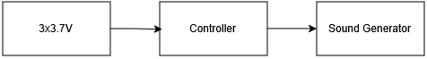
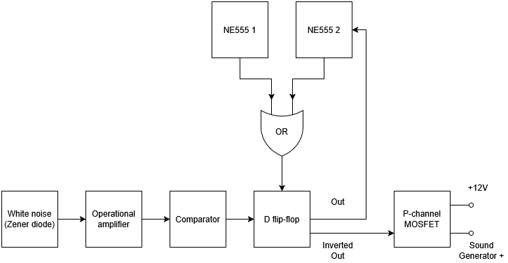
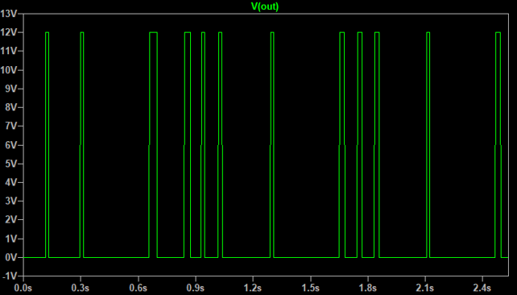
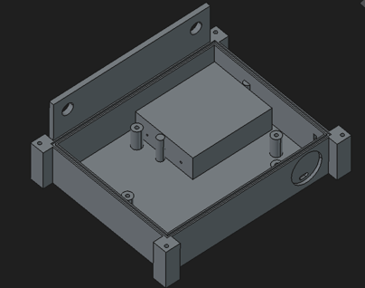
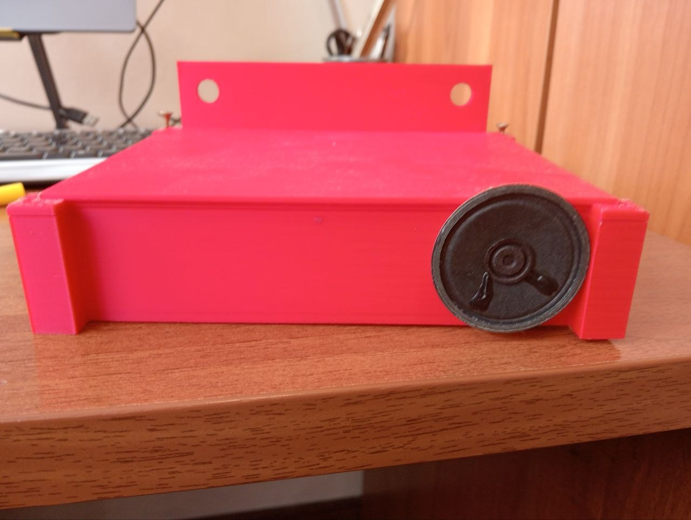
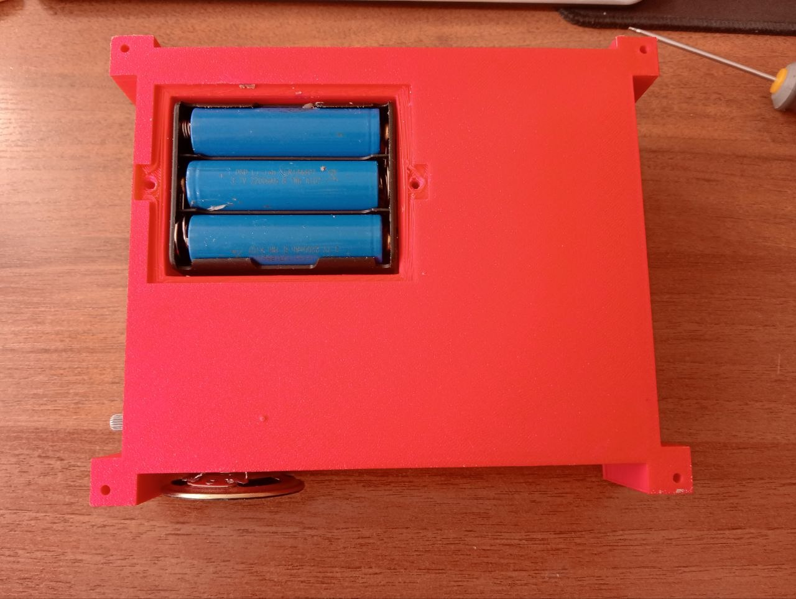
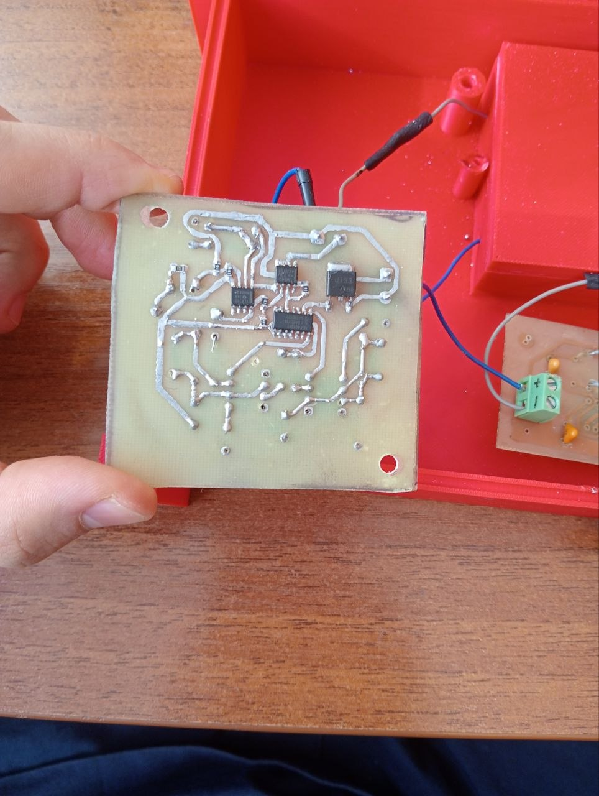
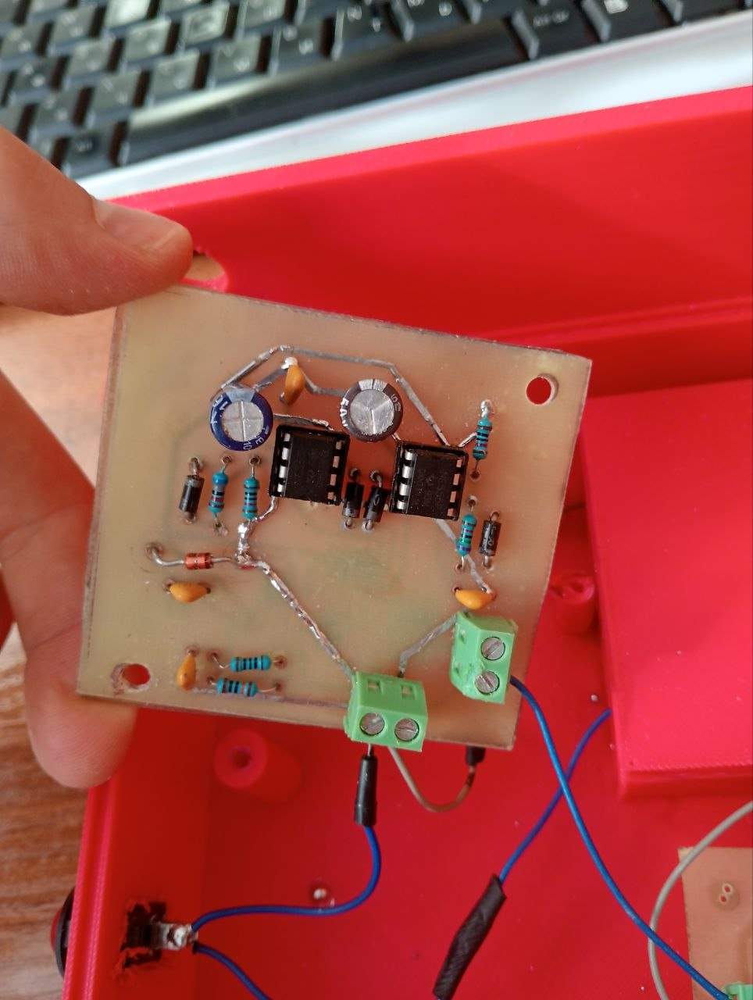

# Autonomiczny Stochastyczny Odstraszacz Ptaków

## 1. Opis zasady działania

**Cel:** W gospodarstwie moich rodziców znajduje się plantacja leszczyny. Jednym z głównych zagrożeń dla orzechów są ptaki. Odstraszacze wykorzystujące pasywny czujnik podczerwieni okazują się nieskuteczne w warunkach sadu, z kolei inne rozwiązania są zbyt drogie. Dlatego właśnie powstał ten projekt. Opracowane urządzenie dąży do eliminacji zjawiska przyzwyczajania się szkodników do powtarzalnego dźwięku dzięki zastosowaniu sygnałów generowanych losowo.

System składa się z trzech głównych modułów:
1. **Moduł zasilania:** Pakiet 3 ogniw Li-Ion 3.7V
2. **Płytka stochastycznego kontrolera:** Układ analogowo-cyfrowy generujący losowe interwały załączania płytki generatora dźwięku.
3. **Płytka generatora dźwięku:** Układ wytwarzający falę prostokątną o częstotliwości 2,1–2,9 kHz, która trafia na glośnik.

W tym repozytorium znajduje się projekt płytki stochastycznego kontrolera.

---

### Zasada działania sterownika:

1. Dioda Zenera pracująca w stanie przebicia lawinowego generuje analogowy szum biały.
2. Niewielkie fluktuacje szumu są wzmacniane przez wzmacniacz operacyjny TL072 (wzmocnienie $A_u \approx 511$), a następnie przekształcane przez komparator LM393 na  ciąg impulsów, podawany na wejście danych $D$ przerzutnika typu D (HEF4013B).
3. * **Timer 1:** Generuje krótkie impulsy co 5 minut.
   * **Timer 2:** Odpowiada za taktowanie krótkich cykli dźwięku (co ok. 5–10 sekund)
4. Przebiegi z obu timerów są podawane przez diodową bramkę logiczną OR na wejście zegarowe $CLK$ przerzutnika.
5. Wyjście proste $Q$ steruje wejściem zerowania ($RESET$) Timera 2, decydując o zakończeniu lub wydłużeniu cyklu odstraszania.
6. Wyjście zanegowane $\overline{Q}$ steruje bramką tranzystora P-MOSFET, który załącza napięcie zasilania dla płytki generacji dźwięku.

Urządzenie załącza się w nieprzewidywalnych odstępach czasu będących wielokrotnością 5 minut (np. 5, 10, 15 min...) na losowy czas trwania będący wielokrotnością 10 sekund (np. 10, 20, 30 s...), co redukuję adaptację ptaków do sygnału. 

> **Uwaga:** Na potrzeby symulacji w LTspice oraz demonstracji wideo, wartości elementów $RC$ w generatorach czasowych zostały przeskalowane w dół, redukując okresy do odpowiednio **~20 s** (zamiast 5 min) oraz **~5 s** (zamiast 10 s)

---

## 2. Realizacja

### Wyniki symulacji (LTspice)

### Obudowa (FreeCAD)

### Demonstracja wideo
[Link](https://www.youtube.com/watch?v=rtPFrEMRT7Q)

### Zmontowany prototyp
|  |  |
|--|--|
|  |  |

## 3. Problemy i napotkane trudności 

Zidentyfikowane problemy:
* Brak hermetyczności obudowy. Wykonano ją z plastiku niskiej jakości i pozbawiono dedykowanych uszczelek.
* Ograniczony czas pracy. Zgodnie z obliczeniami urządzenie może pracować maksymalnie do 3 dni, po czym akumulatory wymagają ponownego naładowania. Również  brakuje modułu kontroli ładowania  (3S BMS)

Napotkane trudności:
#### 1. Symulacja 
* Najpierw prowadziłem symulację stosując idealne modele elementów, co dawało wyniki niezgodne z rzeczywistością. Zamieniłem je na modele wybranych komponentów dla LTSpice.
* Najpierw nie stosowałem kondensatorów odsprzęgających i dlatego wzmacniacz ciągle wchodził w nasycenie. 
#### 2. Projektowanie płytki w KiCAD
* Jako PMOS użyłem najpierw symbolu o kolejności pinów DGS, a footprintu o kolejności pinów GDS, co spowodowało, że sygnał sterujący pojawiał się na Drain zamiast Gate.
* Nie zauważyłem, że LM393 ma otwarty kolektor i dlatego na wejściu Data HEF4013B zawsze było 0V.
* Na dolnej stronie płytki użyłem sterf wypełnionych miedzią jako węzłów dla +12v oraz GND. To sprawiło, że lutowanie lutownicą o małej mocy stało się niemożliwe, bo lut zastygał natychmiastowo.

#### 3. Testowanie
* TL072 niedostatecznie wzmacniał sygnał z diody Zenera i dlatego komparator nie reagował na niego. Zwiększyłem wartości rezystorów, żeby wzmocnienie wynosiło około 500.
* Zauważyłem, że NE555 mocno się grzeją. Okazało się, że rezystory niedostatecznie ograniczały prąd płynący przez kondensator i dlatego tranzystor na pinie Discharge ciągle ulegał uszkodzeniu.    
